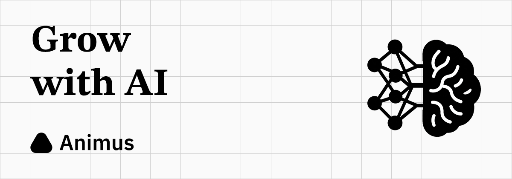

# Animus

Animus is an experimental project positioned between academic research and practical application. Its purpose is to simulate the human brain, leveraging the capabilities of large models and a series of infrastructures. The objective is to explore pathways towards achieving general intelligence while maintaining a balance among "intelligence", "speed", and "power consumption".
