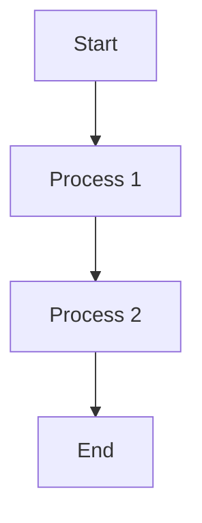

# Markdown Examples

## Autolink literals

- **www.example.com**
- https://example.com
- contact@example.com

## inline styles

_This_ is *italic* text and __this__ is **bold** text.
___This is bold italic___.
~~This is strikethrough text~~.
`This is code` or `` code ``

## Strikethrough

~one~ or ~~two~~ tildes.

## Table

| Column 1 | Column 2     | Column 3   | Column 4    
|:---------|:-------------|:-----------|:------------|
| Data 1   | Very Long Text Data 1 | Text Data 3| Some Text 4 | 
| Data 1   | Very Long Text Data 1 | Text Data 3| Some Text 4 | 
| Data 1   | Very Long Text Data 1 | Text Data 3| Some Text 4 | 

## Tasklist

- [ ] Prepare notes for tomorrow's math class
- [x] Complete the reading assignment for English
- [ ] Review the lost notes for the history class
- [x] Solve puzzles from the physics class
- [ ] Check emails for new homework instructions or notifications
- [x] Preview the chemistry class content for next week

## Quote

> "The only way to do great work is to love what you do." - Steve Jobs

## Callouts

> [!NOTE] This is `NOTE` callout
> Some content is displayed directly! Some content is displayed directly! Some content is displayed directly! Some content is displayed directly! Some content is displayed directly! Some content is displayed directly! 

> [!TIP] This is `TIP` callout
> Some content is displayed directly! Some content is displayed directly! Some content is displayed directly! Some content is displayed directly! Some content is displayed directly! Some content is displayed directly! 

> [!IMPORTANT] This is `IMPORTANT` callout
> Some content is displayed directly! Some content is displayed directly! Some content is displayed directly! Some content is displayed directly! Some content is displayed directly! Some content is displayed directly! 

> [!WARNING] This is `WARNING` callout
> Some content is displayed directly! Some content is displayed directly! Some content is displayed directly! Some content is displayed directly! Some content is displayed directly! Some content is displayed directly! 

> [!CAUTION] This is `CAUTION` callout
> Some content is displayed directly! Some content is displayed directly! Some content is displayed directly! Some content is displayed directly! Some content is displayed directly! Some content is displayed directly! 

### Collapsible

> [!NOTE]- This is a **collapsible** callout
> Some content shown after opening!

> [!NOTE]+ This is a **uncollapsible** callout
> Some content shown after opening!

## Footnote

A note[^1]

[^1]: [John, D., & Smith, B. (2023). Advances in AI research. *International Journal of AI*, 15(2), 345-360](http://examplejournal.com/advances-in-ai-research)

## Image

https://upload.wikimedia.org/wikipedia/en/c/c6/Pluto_discovery_plates.png


## Code

```ts
import { createHighlighter } from 'shiki/bundle/web'

import type { BundledLanguage } from 'shiki/bundle/web'

export const highlight = async (code: string, lang: BundledLanguage) => {
	const highlighter = await createHighlighter({
		langs: ['typescript', 'javascript'],
		themes: ['github-dark']
	})
	const code_text = highlighter.codeToHtml(code, { lang, theme: 'github-dark', structure: 'inline' })

	const lines = code.split('\n')
	const length = lines.length

	let line_numbers = ''

	for (let i = 0; i < length; i++) {
		if (i !== length - 1) {
			line_numbers += `<span class="line_number">${i + 1}</span>`
		}
	}

	return `<div class="line_numbers_wrap">${line_numbers}</div><pre class="pre_code_wrap">${code_text}</pre>`
}
```

## Math

This is an inline formula $E = mc^2$.

$$
\boxed{\int_{\Omega} \nabla \cdot \mathbf{F} \, d\Omega + \int_{\partial \Omega} \mathbf{F} \cdot \mathbf{n} \, d\partial \Omega = \iiint_{V} \nabla \cdot \mathbf{G} \, dV + \iint_{\partial V} \mathbf{G} \cdot \mathbf{n} \, d\partial V}
$$

## Mermaid

